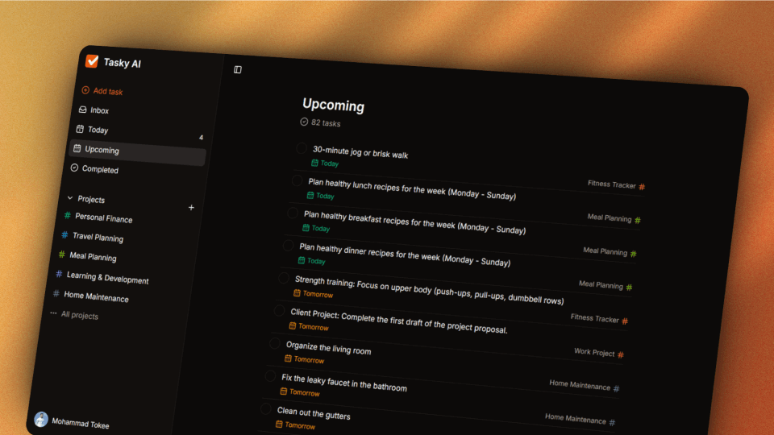

<div align="center">
  <br />
    
  <br />

  <div>
    
    
    
<br/>


  </div>
</div>

# 📋 Tasky AI

**Tasky AI** is an AI-assisted task management platform built with **React**, **TypeScript**, and **Vite**.  
It combines **Clerk authentication**, **Appwrite persistence**, and **Google Gemini–powered task generation** to help individuals and teams plan and manage work efficiently across multiple productivity views — Inbox, Today, Upcoming, Completed, and Project-focused sections.

---

## 📋 Table of Contents

- [Features](#features)
- [Tech Stack](#tech-stack)
- [Getting Started](#getting-started)
- [Usage](#usage)
- [Folder Structure & Architecture](#folder-structure--architecture)
- [Core Services & Modules](#core-services--modules)
- [Author](#author)

---

## 🚀 Features

- **Secure authentication & theming** — powered by Clerk with a global router shell, dark theme, and toast notifications.
- **Multiple productivity workspaces** — Inbox, Today, Upcoming, Completed, and Project detail pages, each delivered through lazy-loaded protected routes.
- **AI-generated project task scaffolding** — converts natural language prompts into structured tasks using Google Gemini, automatically persisted via Appwrite when AI assistance is enabled.
- **Appwrite-backed data layer** — provides reusable query builders for counting, filtering, and scheduling tasks.
- **Responsive, accessible UI** — optimized for different devices, highlighting AI workflows and session-based navigation states.

---

## 🧰 Tech Stack

| Category                 | Technologies                                                |
| ------------------------ | ----------------------------------------------------------- |
| **Framework**            | React + TypeScript                                          |
| **Authentication**       | Clerk React SDK                                             |
| **Backend-as-a-Service** | Appwrite SDK                                                |
| **AI Integration**       | Google Gemini                                               |
| **Styling**              | Tailwind CSS, Shadcn UI                                     |
| **Testing & Quality**    | Vitest, React Testing Library, Playwright, ESLint, Prettier |
| **CI/CD & Tooling**      | Pnpm, GitHub, GitHub Actions, Vite                          |

---

## ⚙️ Getting Started

### 1. Clone the repository

```bash
git clone <repo-url>
cd Tasky-ai
```

### 2. Install dependencies

```bash
pnpm install
```

### 3. Configure environment variables

Create a `.env` (or `.env.local`) file at the project root and provide the required keys:

```bash
VITE_CLERK_PUBLISHABLE_KEY="..."
VITE_CLERK_USER_STORAGE_KEY="..."
VITE_APPWRITE_PROJECT_ID="..."
VITE_APPWRITE_TASKS_COLLECTION_ID="..."
VITE_APPWRITE_PROJECTS_COLLECTION_ID="..."
VITE_APPWRITE_ENDPOINT="https://cloud.appwrite.io/v1"
VITE_APPWRITE_DATABASE_ID="..."
VITE_GEMINI_API_KEY="..."
```

These values are validated at runtime to prevent misconfiguration.

### 4. Start the development server

```bash
pnpm run dev
```

The app will be available at [http://localhost:5173](http://localhost:5173).

---

## 🧪 Usage

### Run the test suite

```bash
pnpm run test
```

### Build for production

```bash
pnpm run build
```

### Lint & format source

```bash
pnpm run lint
pnpm run prettier:check
```

Additional scripts are available for coverage, lint fixing, and auto-formatting.

---

## 🏗️ Folder Structure & Architecture

```bash
src/
├── assets/          # Static assets for marketing and app surfaces
├── components/      # Reusable UI blocks (atoms → organisms → templates)
├── config/          # Runtime configuration (environment schema)
├── constants/       # Shared constants (routes, defaults)
├── hooks/           # Custom React hooks
├── lib/             # External clients (Appwrite, Google Gemini)
├── pages/           # Route-level screens
├── queries/         # Appwrite query builder utilities
├── repositories/    # Data-access abstractions over Appwrite
├── router/          # Route definitions, loaders, actions
├── services/        # Domain logic orchestrating repositories & utilities
├── types/           # Shared TypeScript types & interfaces
├── utils/           # Cross-cutting helpers (auth, text, responses)
└── tests/           # Global Vitest / jsdom setup
```

### Architectural Layers

- **Routing layer:** `src/router` — centralizes public/protected routes, lazy components, loaders, and actions.
- **Service layer:** `src/services` — encapsulates business logic like AI-assisted project creation and bulk persistence.
- **Data access:** `src/repositories` — wraps Appwrite operations with consistent filtering/query logic.
- **Infrastructure clients:** `src/lib` — configures external SDKs (Appwrite, Google Gemini).
- **Presentation layer:** `src/pages` — responsive UI integrated with Clerk session handling.

---

## 🧩 Core Modules

- **Authentication shell (`src/App.tsx`)** — wraps the router with `ClerkProvider`, adds theming and global toasts.
- **Task service (`src/services/task/task.service.ts`)** — aggregates counts, filters by context, and mutates Appwrite documents.
- **Project service (`src/services/project/project.service.ts`)** — manages project creation, updates, deletion, and track recent projects.
- **AI service (`src/services/ai/ai.service.ts`)** — handles Gemini requests, parses JSON responses, and validates structure.
- **Action handlers (`src/router/actions/*`)** — manages create/update/delete actions and AI-generated task wiring.
- **State loaders (`src/router/loaders/*`)** — fetch and normalize route data before render (SSR-like).
- **Third party libraries (`src/lib/*`)** — centralized clients and adapters for external services
- **Appwrite repositories (`src/repositories/*`)** — provide reusable CRUD operations for tasks/projects.

---

## 👨‍💻 Author

Developed by **Elvin Sarkarov**  
📎 [GitHub @Elvin Sarkarov](https://github.com/esarkarov)
